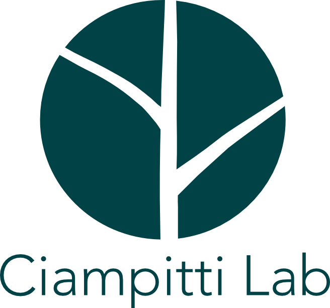
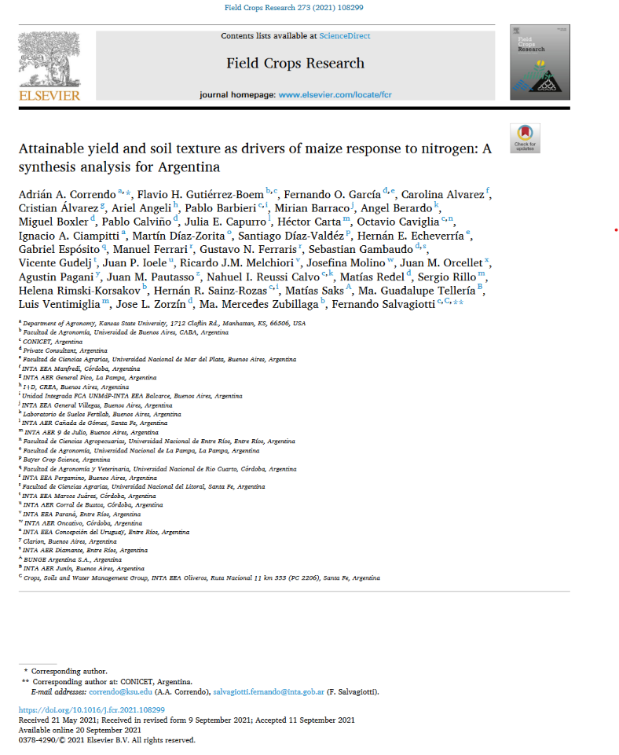

```{r setup, include=FALSE}
library(flexdashboard)
library(shiny)
library(shinydashboard)
library(shinythemes)
library(bslib)
library(dplyr)
library(tidyr)
library(ggplot2)
library(xgboost)
library(plotly)
library(DT)
tags$style("@import url(https://use.fontawesome.com/releases/v6.1.1/css/all.css);")
```

```{r}

# Loading Data
curvas <- readRDS( file = "data/curvas.RDS")
coeff <- readRDS( file = "data/coeff.RDS")


```

Main {data-orientation=columns}
===================================== 

## Column {data-width="150"}

### INSTRUCCIONES

```{r}
# Yield Environment
shiny::selectInput(
  inputId = "texture_choice",
  label   = "1. Seleccione Ambiente de Rendimiento",
  choices = c("Muy Bajo (<8.5 Mg/ha)" = "1.Muy bajo",
              "Bajo (>8.5 Mg/ha)" = "2.Bajo",
              "Medio (>10.1 Mg/ha)" = "3.Medio",
              "Alto (>11.5 Mg/ha)" = "4.Alto",
              "Muy Alto (>13.1 Mg/ha)" = "5.Muy Alto")
  )

# Soil Texture
shiny::selectInput(
  inputId = "yield_environment_choice",
  label   = "2. Seleccione Textura de Suelo",
  choices = c("Arcilloso" = "Fine",
              "Medio" = "Medium",
              "Arenoso" = "Coarse")
  )

# Soil N
shiny::sliderInput("PPNT", "3. N-NO3 Pre-siembra, kg N/ha (0-60cm)", value = 70,  min = 0, max = 250, step = 50)

# N price
shiny::sliderInput("N_price", "4. Costo N, US$/kg N", value = 2.8,  min = 1, max = 3.0, step = 0.1)

# Grain price
shiny::sliderInput("Grain_price", "5. Precio Grano, US$/kg grano", value = 0.22,  min = 0.1, max = 0.7, step = 0.1)


# Reactive data after choices
data_plot <- reactive({
  curvas %>%
     filter(Q == input$texture_choice,
            TEXT == input$yield_environment_choice )
  })

```

## Column {data-width="400"}

### CURVA DE RESPUESTA PROBABLE

```{r}

# Create plotly
renderPlotly({
   
   plot <- curvas %>%
     # filter(Q == "4.Alto",
     #        TEXT == "Medium" ) %>% 
     filter(Q == input$texture_choice,
            TEXT == input$yield_environment_choice ) %>% 
     ggplot(aes(x = Ns, y = y))+
     geom_path(size = 2,
                       color = case_when(
                         input$yield_environment_choice == "Fine" ~ "#ba3037",
                         input$yield_environment_choice == "Medium" ~ "#2c61d4",                                     TRUE ~ "#5e691f"))+
     scale_y_continuous(breaks=seq(0,16000, 1000), limits = c(0,16000))+
     scale_x_continuous(breaks=seq(0,400, 50), limits = c(0,400))+
     geom_vline(xintercept = Outputs()$AONav, size = 1,
                linetype = "dashed", color = "steelblue")+
     geom_vline(xintercept = Outputs()$EONav, size = 1,
                linetype = "dotted", color = "#a6808c")+
     ggplot2::annotate("pointrange",
                       label = "Disponibilidad Optima Agronomica",
                       shape = 25, size = 4,
                       x = Outputs()$AONav, y = 0, 
                       xmin = Outputs()$AONav, xmax = Outputs()$AONav,
                       color = "grey15", fill = "steelblue",
                       angle = '90', hjust = 0)+
     ggplot2::annotate("pointrange",
                       label = "Disponibilidad Optima Economica",
                       shape = 25, size = 4,
                       x = Outputs()$EONav, y = 0, 
                       xmin = Outputs()$EONav, xmax = Outputs()$EONav,
                       color = "grey15", fill = "#a6808c", 
                       angle = '90', hjust = 0)+
     theme_bw()+
     labs(x = "N suelo+fertilizante (kg N/ha, 0-60 cm)",
          y = "Rendimiento Maiz (kg/ha)")+
     theme(panel.grid = element_blank(),
           axis.text.x = element_text(size=rel(1.25), color = "black"),
           axis.text.y = element_text(size=rel(1.25), color = "black"),
           axis.title = element_text(size=rel(1.75), color = "black"),
           strip.text = element_text(size=rel(1.25), color = "black"),
           legend.title = element_text(size = rel(1)),
           legend.position = "top", legend.key.size = unit(2.5,"line"),
           legend.text = element_text(size = rel(1)),
           legend.key.width = unit(2.5,"line")
             )
   
  ggplotly(plot)
 
 })

# Render plotly 
#plotlyOutput(outputId = "plotly_1")


```


## Column {data-width="180"}

### RELACION DE PRECIOS
```{r}

PRatio <- eventReactive( 
  
  input$N_price / input$Grain_price,
  round(as.numeric(input$N_price/ input$Grain_price), 1)
  
  )

flexdashboard::renderGauge({
  
  flexdashboard::gauge( PRatio(), min = 0, max = 15, symbol = '',
                        gaugeSectors( success = c(0,6), warning = c(6.001,12), danger = c(12, 15),
                                      colors = c("#2a9d8f", "#fcbf49", "#ce4257")
                        )
  )
  
})

```

### Disponibilidad Optima Agronomica
```{r}

Outputs <- reactive({
  
  coeff %>%
    filter(Q == input$texture_choice,
           TEXT == input$yield_environment_choice)%>%
    mutate(AONav = Xc,
           AONr = ifelse(Xc - input$PPNT >= 0, Xc - input$PPNT, 0),
           EONav = (PRatio() - b)/(2*B2),
           EONr = ifelse(((PRatio() - b)/(2*B2)- input$PPNT) >= 0,((PRatio() - b)/(2*B2)- input$PPNT),0 )  )

})


flexdashboard::renderValueBox({
  
  flexdashboard::valueBox(paste(round(Outputs()$AONav,0), "kg N/ha"), 
            "Disponibilidad Optima Agronomica", 
            icon = "fa-bullseye", 
            color = "steelblue")
  }) 

```

### Dosis Optima Agronomica
```{r}

flexdashboard::renderValueBox({
  
  flexdashboard::valueBox(paste(round(Outputs()$AONr,0), "kg N/ha"), 
            "Dosis Optima Agronomica", 
            icon = "fa-seedling", 
            color = "#2a9d8f")
  }) 

```

### Disponibilidad Optima Economica
```{r}

flexdashboard::renderValueBox({
  
  flexdashboard::valueBox(paste(round(Outputs()$EONav,0), "kg N/ha"), 
            "Disponibilidad Optima Economica", 
            icon = "fa-coins", 
            color = "#a6808c")
  }) 

```


### Dosis Optima Economica

```{r}


flexdashboard::renderValueBox({
  
  flexdashboard::valueBox(paste(round(Outputs()$EONr, 0), "kg N/ha"), 
            "Dosis Optima Economica", 
            icon = "fa-usd", 
            color = "#fb8f67")
  
  }) 

```

### 

Datos propios {data-orientation=columns}
===================================== 

```{r}

source(file = "quadratic_plateau.R")

data_ex <- read.csv(file = "data_corn.csv", header = TRUE)

ggplotly(quadratic_plateau(data = data_ex, yield = y, Nav = x, plot = TRUE))

model <- quadratic_plateau(data = data_ex, yield = y, Nav = x, plot = FALSE, tidy = TRUE)

PPNT <- 20
PRatio <- 10

model_q <- model %>% 
mutate(AONav = CSTV,
       AONr = ifelse(AONav - PPNT >= 0, AONav - PPNT, 0),
       B2 = slope / (2*AONav),
       EONav = (PRatio - slope)/(2*B2),
       EONr = ifelse(((PRatio - slope)/(2*B2)- PPNT) >= 0,
                     ((PRatio - slope)/(2*B2)- PPNT),0 )  )

```


About {data-orientation=columns}
===================================== 

Column {data-width=5}
-----------------------------------------------------------------------

Column {data-width=40}
-----------------------------------------------------------------------
<a href = "https://ciampittilab.wixsite.com/ciampitti-lab"></a>

Column {data-width=5}
-----------------------------------------------------------------------

Column {data-width=400}
-----------------------------------------------------------------------

```{r}

mainPanel(
            h1("Description"),
            p("Translating scientific knowledge into practical tools is one of the 
              core missions we pursue at",
              a("CiampittiLab",
                href = "https://ciampittilab.wixsite.com/ciampitti-lab"), 
              ". The DONMaiz webtool is based on a synthesis-review analysis performed by Correndo et al. (2021). With the collaboration of multiple corn and fertilization experts from diverse institutions in Argentina, we compiled and analized a database of 788 corn N fertilization trials carried out under a wide spectrum of soil and weather conditions across the Pampas."),
            p("The tool requires simple data inputs:"),
            p("  1. Attainable yield"),
            p("  2. Soil Texture"),
            p("  3. Pre-plant NO3-N test value at 0-60cm, kg N/ha"),
            p("  4. Nitrogen price, in US $/kg N"),
            p("  5. Corn grain price, in US $/kg grain"),
            tags$hr()
        ) 


```

```{r}
mainPanel(
            h2("Citation"),
            p("Correndo, A., Gutierrez'Boem, F.H., Garcia, F.O. Alvarez, C., Alvarez, C., Angeli, A., Barbieri, P., Barraco, M., Berardo, A., Boxler, M., Calviño, P.A., Capurro, J.E., Carta, H., Caviglia, O., Ciampitti, I.A., Diaz-Zorita, M., Diaz-Valdez, S., Echeverria, H.E., Esposito, G., Ferrari, M., Ferraris, G.N., Gambaudo, S., Gudelj, V., Ioele, J.P., Melchiori, R., Molino, J., Orcellet, J.M., Pagani, A., Pautasso, J.M., Reussi Calvo, N.I., Redel, M., Rillo, S., Rimski-Korsakov, H., Sainz-Rozas, H.R., Saks, M., Telleria, Ma.G., Ventimiglia, L., Zorzin, J.L., Zubillaga, Ma.M., Salvagiotti, F.  (2021). Assessing the uncertainty of maize yield without nitrogen fertilization. Field Crops Res. 260, 107985",
              a("https://doi.org/10.1016/j.fcr.2021.108299",
                href = "https://doi.org/10.1016/j.fcr.2021.108299"))
)

```

<a href = "https://doi.org/10.1016/j.fcr.2021.108299"></a>

<a href = "https://doi.org/10.1016/j.fcr.2021.108299"></a>

```{r}

mainPanel(h3("Credits"),
          p("This application was designed by Adrian Correndo and Gustavo Nocera Santiago using shiny."),
          p("Chang et al. (2021). _shiny: Web  Application Framework for R_. R package version 1.7.1,",
            a("<https://CRAN.R-project.org/package=shiny>", 
              href = "https://CRAN.R-project.org/package=shiny"))
          )

```

